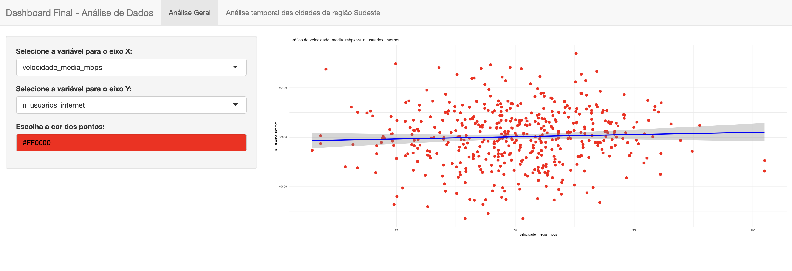
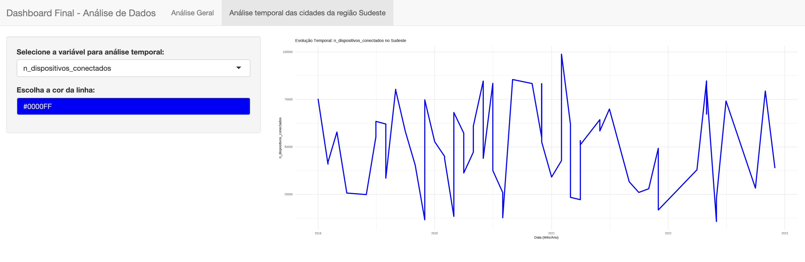

```{r setup, include=FALSE}
knitr::opts_chunk$set(echo = TRUE)
```


# Introdução
#### Instalação de Pacotes

```{r importando bibliotecas, echo = TRUE}
library(tidyverse)
library(purrr)
library(dlookr)
library(summarytools)
library(readxl)
library(knitr)
library(data.table)
library(ggpubr)
library(corrplot)
library(rcompanion)
library(dplyr)
library(stringr)
library(lubridate)
library(ggplot2)
library(naniar)
library(simputation)
library(mice)
library(GGally)
```
```{r}
capabilities("tcltk")
```
#### Leitura das bases de dados
```{r importando dados, echo = FALSE}
tech <- readr::read_csv("/Users/tatianasantanna/Documents/Particular/MBA Data Science/Análise exploratória de dados/BaseTecnologiaMensalCidades.csv",
                        locale = readr::locale(encoding = "UTF-8"))

```

## Introdução: Escolha da Base de Dados

A base de dados utilizada neste projeto foi elaborada de forma simulada com apoio do assistente ChatGPT, para fins acadêmicos e didáticos. Seu objetivo é representar a evolução de indicadores tecnológicos em cidades brasileiras ao longo do tempo, permitindo praticar a disciplina de análise exploratória e imputação de dados. Cada registro corresponde a uma observação mensal de uma cidade, contemplando variáveis relacionadas ao acesso à internet, inovação, investimentos públicos, atividade empreendedora e produção tecnológica.

O formato da base possibilita a análise de múltiplas variáveis contínuas, com destaque para o número de usuários de internet e a velocidade média da conexão. A escolha desta base foi feita pela diversidade de registros e pela presença controlada de dados faltantes, fatores importantes para o desenvolvimento do projeto.

O objetivo principal da análise é investigar o comportamento do número de usuários de internet em situações específicas onde a velocidade média ultrapassa de 50 Mbps, permitindo identificar padrões de acesso em cenários de melhor qualidade de conexão.

**Fonte:** Base simulada criada para fins acadêmicos com apoio de [ChatGPT](https://openai.com/chatgpt) e adaptada pelo aluno.

## Descrição do Espaço Amostral

O espaço amostral deste projeto é composto por registros mensais de cidades do Brasil. Cada elemento da base refere-se a um par cidade/mês, como por exemplo "São Paulo - Janeiro/2020". 

O evento aleatório considerado é a seleção de registros em que a velocidade média da internet superou 50 Mbps. O objeto de interesse é o número de usuários de internet (n_usuarios_internet) nesses casos específicos.

Cada indivíduo analisado representa uma cidade em um determinado mês, e o espaço amostral completo abrange todas as cidades disponíveis na base de dados, independentemente da ocorrência ou não do evento analisado.

# Análise Exploratória

## Utilizando o pacote summarytools (função descr) para descrever estatisticamente a base de dados
```{R}
descr(tech, plain.ascii = FALSE, style = "rmarkdown")
summary(tech)
sum(tech$velocidade_media_mbps < 0, na.rm = TRUE)
```

Após a aplicação da função descr() do pacote summarytools, foi possível obter uma descrição estatística detalhada das variáveis numéricas da base de dados.
Observou-se que a velocidade média da internet nas cidades analisadas apresenta uma média de aproximadamente 50,09 Mbps, com um desvio padrão de 14,98 Mbps, indicando uma variação moderada entre as cidades. A mediana foi de 50,10 Mbps, valor próximo da média, sugerindo uma distribuição relativamente simétrica, confirmada pelo valor de Skewness próximo de zero. 
Em relação ao número de usuários de internet, ele mostra que a base é extremamente estável, com baixa variação entre cidades/meses. A média foi de aproximadamente 50.000 usuários, com pequena variação (desvio padrão de cerca de 223 usuários).
De maneira geral, a base apresenta uma quantidade elevada de registros válidos para todas as variáveis, com mais de 96,97% dos dados completos em cada variável analisada.

As variáveis **n_usuarios_internet** e **velocidade_media_mbps** são bastante diferentes em comportamento: a primeira é muito estável, a segunda muito dispersa.
A variável **velocidade_media_mbps** é a que tem alguns dados faltantes.


### Modificações e ajustes (acertos nos campos de data para um mesmo formato)
```{R}


#tech <- tech %>%
#  mutate(
#    mes_ano_corrigido = str_replace(mes_ano, "m", "-01"),
#    mes_ano_data = as.Date(mes_ano_corrigido, format = "%Y-%m-%d")
#  )
  
tech <- tech %>%
  mutate(
    mes_ano_data = as.Date(paste0(str_sub(mes_ano, 1, 4), "-", str_sub(mes_ano, 6, 7), "-01"))
  )
```

### Limpando os dados, filtrando e realizando diagnóstico
```{R}


tech_filter <- tech %>%
  select(cidade, mes, ano, n_usuarios_internet, velocidade_media_mbps,
         n_dispositivos_conectados, investimento_publico_tecnologia) %>%
  mutate(mes_ano = as.Date(paste(ano, mes, "01", sep = "-"))) %>%
  filter(ano %in% 2019:2022) %>%
  distinct(cidade, mes_ano, .keep_all = TRUE)

```


#### Pra ir cercando o problema, primeiro preciso fazer a descrição dos dados, através do diagnose
```{R}


tech_filter %>% dlookr::diagnose()

```
 A base de dados filtrada foi analisada quanto à completude e tipos de variáveis. Observou-se que a estrutura da base está adequada, com todas as variáveis devidamente tipadas (caracteres, numéricas ou datas) e uma baixa ocorrência de valores faltantes. Apenas a variável **velocidade_media_mbps** apresentou 2,5% de valores ausentes. 
Dá pra tentar identificar se é totalmente aleatório ou não e tentar preencher com as técnicas específicas.

Podemos também visualizar os dados faltantes através de um gráfico de barras percentual, gerado pela biblioteca naniar e função vis_miss.

```{r}
tech_filter %>% dplyr::mutate(mes_ano = as.IDate(paste("01", mes, ano, sep = "-"), format = "%d-%m-%Y")) %>% dplyr::select(cidade, mes_ano, n_usuarios_internet:investimento_publico_tecnologia) %>% naniar::vis_miss()
```

O gráfico confirma os dados faltantes apenas na variável **velocidade_media_mbps**.

## Verificar a aleatoriedade dos meus dados faltantes para a variável velocidade_media_mbps usando o teste de Little
```{R}

tech %>%
  select(velocidade_media_mbps) %>%
  mcar_test()

tech %>% dplyr::select(velocidade_media_mbps) %>% naniar::mcar_test()
```

Quando p-value ≤ 0, **rejeitamos a hipótese nula do teste de dados completamente aleatórios a qualquer nível de significância**. Isso significa que os dados faltantes não são completamente aleatórios.
Ou seja, os valores faltantes estão relacionados a alguma variável ou a algum padrão no seu conjunto de dados.


## Realizando análise da relação entre a distribuição de missing e das variáveis observadas

```{r}
tech %>%
  dplyr::group_by(cidade) %>% dplyr::filter(is.na(velocidade_media_mbps)) %>%
  dplyr::summarise(n = n()) %>% dplyr::ungroup() %>% 
  dplyr::mutate(tot.miss = sum(n)) %>% dplyr::group_by(cidade) %>% 
  dplyr::mutate(tot.miss.regiao = sum(n), freq.intra.regiao = n/tot.miss.regiao, freq.regiao = tot.miss.regiao/tot.miss) %>% dplyr::arrange(desc(freq.regiao), desc(n)) %>% kable()
```

A maior quantidade de dados faltantes ocorre em Belo Horizonte e Rio de Janeiro, ambos com 109 registros faltantes, representando mais ou menos 11% dos dados faltantes cada um. Logo depois vem Salvador, com 105.
As três cidades do Sudeste (Rio de Janeiro, São Paulo e Belo Horizonte) concentram juntas uma parte relevante dos dados faltantes de velocidade de internet.

### Corrigindo os valores negativos da variável velocidade_media_mbps para NA
```{r}
tech_filter$velocidade_media_mbps[tech_filter$velocidade_media_mbps < 0] <- NA
```


# Testes de imputação de dados - knn
```{r}
tech_filter_knn <- tech_filter %>%
  select(cidade, mes_ano, velocidade_media_mbps) %>%  
  as.data.frame() %>%                                
  simputation::impute_knn(velocidade_media_mbps ~ cidade + mes_ano, k = 5, seed = 512) %>%  
  dplyr::mutate(velocidade_media_mbps = as.numeric(velocidade_media_mbps))


```
## Comparando a imputação dos dados com o realizado para velocidade para o método knn
```{r}
ggplot(tech_filter, aes(x = velocidade_media_mbps)) +
  geom_histogram(binwidth = 5, fill = "lightblue", color = "black") +
  ggtitle("Distribuição - Antes da Imputação")


ggplot(tech_filter_knn, aes(x = velocidade_media_mbps)) +
  geom_histogram(binwidth = 5, fill = "lightgreen", color = "black") +
  ggtitle("Distribuição - Após Imputação knn")
```

# Teste de imputação dos dados - método de imputação múltipla (pmm)

```{r}
tech_filter <- tech_filter %>%
  mutate(velocidade_media_mbps = ifelse(velocidade_media_mbps < 0, NA, velocidade_media_mbps))

tech_velocidade <- tech_filter %>%
  select(velocidade_media_mbps, n_usuarios_internet)

metodos <- c("pmm", "")

tech_filter_multiplo <- mice(
  tech_velocidade,
  method = metodos,
  m = 10,
  maxit = 5,
  seed = 512,
  printFlag = FALSE
)

stripplot(tech_filter_multiplo, pch = c(21, 20), cex = c(1, 1.5))

```
## Comparando a imputação dos dados com o realizado para velocidade para o método de imputação múltipla
```{r}
dados_imputados <- complete(tech_filter_multiplo, 1)

# Gráfico antes da imputação
ggplot(tech_filter, aes(x = velocidade_media_mbps)) +
  geom_histogram(binwidth = 5, fill = "lightblue", color = "black") +
  ggtitle("Distribuição - Antes da Imputação")

# Gráfico depois da imputação
ggplot(dados_imputados, aes(x = velocidade_media_mbps)) +
  geom_histogram(binwidth = 5, fill = "lightgreen", color = "black") +
  ggtitle("Distribuição - Após Imputação Múltipla")
```


# Teste de imputação de dados - método midastouch (pmm ponderado)
```{r}
tech_filter <- tech_filter %>%
  mutate(velocidade_media_mbps = ifelse(velocidade_media_mbps < 0, NA, velocidade_media_mbps))

tech_velocidade <- tech_filter %>%
  select(velocidade_media_mbps, n_usuarios_internet)

metodos <- c("midastouch", "")

tech_filter_multiplo_midas <- mice(
  tech_velocidade,
  method = metodos,
  m = 10,
  maxit = 5,
  seed = 512,
  printFlag = FALSE
)

stripplot(tech_filter_multiplo_midas, pch = c(21, 20), cex = c(1, 1.5))
```

## Comparando a imputação dos dados com o realizado para velocidade para o método midastouch
```{r}
dados_imputados_midas <- complete(tech_filter_multiplo_midas, 1)

# Gráfico antes da imputação
ggplot(tech_filter, aes(x = velocidade_media_mbps)) +
  geom_histogram(binwidth = 5, fill = "lightblue", color = "black") +
  ggtitle("Distribuição - Antes da Imputação")

# Gráfico depois da imputação
ggplot(dados_imputados_midas, aes(x = velocidade_media_mbps)) +
  geom_histogram(binwidth = 5, fill = "lightgreen", color = "black") +
  ggtitle("Distribuição - Após Imputação Múltipla")
```

Conclusão: a imputação múltipla usando o **método PMM**, na minha opinião, foi a que, por detalhes, melhor preservou o padrão original da variável velocidade, a simetria e o alcance dos dados. Ele mantém a distribuição empírica dos dados observados, sem criar valores que destoam do conjunto.

## Completando a base com o valor imputado
```{r}
tech_velocidade_imputado <- complete(tech_filter_multiplo, 1)

tech_filter$velocidade_media_mbps <- tech_velocidade_imputado$velocidade_media_mbps

summary(tech_filter)
```

# Sobre a normalidade das variáveis
O projeto pede para que eu:
- Descreva o que é uma distribuição normal;
- Crie um histograma para cada variável da sua base de dados. Justifique a escolha do número de bins para seu trabalho. (usando o pacote ggplot);
- Crie um gráfico Q-Q para cada variável de sua base de dados. (use as funções presentes no pacote ggpubr);
- Execute um teste de normalidade Shapiro-Wilk;
- Baseado nos itens anteriores, é possível afirmar que algumas das variáveis se aproximam de uma distribuição normal? Justifique.

Respondendo o que foi solicitado: distribuição Normal é um tipo de distribuição de probabilidade contínua que é simétrica em torno da média, formando o famoso "formato de sino". Em uma distribuição normal, a maioria dos valores está próxima da média, e valores mais extremos são cada vez mais raros. Essa distribuição é importante porque muitas análises estatísticas assumem normalidade dos dados.

## Histograma para cada variável

### Definir o número de bins com a fórmula de Sturges (aproximadamente)
```{r}
n <- nrow(tech_filter)
bins_sturges <- ceiling(log2(n) + 1)
```
O número de bins foi determinado utilizando a fórmula de Sturges, considerando o tamanho da amostra. Essa escolha visa equilibrar a representação detalhada dos dados sem gerar sobrecarga visual no histograma.

### Histograma + curva de densidade do número de usuários
```{r}
tech %>%
  ggplot(aes(x = n_usuarios_internet)) +
  geom_histogram(aes(y = after_stat(density)), fill = "lightblue", bins = bins_sturges) +
  geom_density(color = "red", size = 1.2) +
  labs(
    title = "Distribuição do Número de Usuários de Internet",
    x = "Número de Usuários",
    y = "Densidade"
  ) +
  theme_minimal()

```

O histograma e a curva de densidade indicam que a variável "Número de Usuários de Internet" apresenta uma distribuição **aproximadamente normal**, com formato simétrico e concentração de valores próximos à média. Essa análise visual reforça a avaliação de normalidade da variável para as próximas etapas do estudo.

### Histograma: Número de Dispositivos Conectados
```{r}
ggplot(tech_filter, aes(x = n_dispositivos_conectados)) +
  geom_histogram(bins = bins_sturges, fill = "lightgreen", color = "black") +
  labs(title = "Histograma - Dispositivos Conectados", x = "Dispositivos", y = "Frequência")
```

### Histograma: Investimento Público
```{r}
ggplot(tech_filter, aes(x = investimento_publico_tecnologia)) +
  geom_histogram(bins = bins_sturges, fill = "lightpink", color = "black") +
  labs(title = "Histograma - Investimento Público em Tecnologia", x = "Investimento", y = "Frequência")
```

### Histograma: Velocidade Média (Mbps)
```{r}
ggplot(tech_filter, aes(x = velocidade_media_mbps)) +
  geom_histogram(bins = bins_sturges, fill = "lightyellow", color = "black") +
  labs(title = "Histograma - Velocidade Média (Mbps)", x = "Velocidade (Mbps)", y = "Frequência")

```

Número de Usuários de Internet: Apresenta distribuição **aproximadamente simétrica**, com formato semelhante a uma curva normal.

Número de Dispositivos Conectados: Apresenta distribuição **irregular e dispersa**, sem padrão de simetria claro, afastando-se da normalidade.

Investimento Público em Tecnologia: Distribuição assimétrica à direita, com cauda longa, indicando **afastamento da normalidade**.

Velocidade Média (Mbps): Distribuição altamente assimétrica à direita, com concentração em valores mais baixos e cauda longa, caracterizando **desvio da normalidade**.


## Gráficos Q-Q

### Gráfico Q-Q: Número de Usuários
```{r}
ggqqplot(tech_filter$n_usuarios_internet, title = "Q-Q Plot - Número de Usuários")
```

### Gráfico Q-Q: Número de Dispositivos Conectados
```{r}
ggqqplot(tech_filter$n_dispositivos_conectados, title = "Q-Q Plot - Dispositivos Conectados")
```

### Gráfico Q-Q: Investimento Público
```{r}
ggqqplot(tech_filter$investimento_publico_tecnologia, title = "Q-Q Plot - Investimento Público")
```

### Gráfico Q-Q: Velocidade Média (Mbps)
```{r}
ggqqplot(tech_filter$velocidade_media_mbps, title = "Q-Q Plot - Velocidade Média (Mbps)")
```


Usuários de Internet: distribuição **aproximadamente normal**.

Dispositivos Conectados: um **pouco afastado da normalidade**, mas próximo.

Investimento Público: forte **desvio da normalidade**.

Velocidade Média (Mbps): leve **desvio da normalidade**.


## Teste de normalidade Shapiro-Wilk
```{r}
shapiro.test(tech_filter$n_usuarios_internet)
shapiro.test(tech_filter$n_dispositivos_conectados)
shapiro.test(tech_filter$investimento_publico_tecnologia)
shapiro.test(tech_filter$velocidade_media_mbps)
```
Número de Usuários de Internet:
- p-valor = 0,09462
- **Não rejeita** a normalidade (distribuição normal).

Número de Dispositivos Conectados:
- p-valor = 4.023e-11
- **Rejeita** a normalidade (distribuição não normal).

Investimento Público em Tecnologia:
- p-valor = 2.947e-10
- **Rejeita** a normalidade (distribuição não normal).

Velocidade Média (Mbps):
- p-valor = 0.4506
- **Não rejeita** a normalidade (distribuição aproximadamente normal).


Com base na análise combinada dos histogramas, gráficos Q-Q e testes de Shapiro-Wilk, conclui-se que as variáveis **Número de Usuários de Internet** e **Velocidade Média (Mbps)** podem ser consideradas **aproximadamente normais**, enquanto **Número de Dispositivos Conectados** e **Investimento Público em Tecnologia** apresentam desvios que indicam a **ausência de normalidade**.


# Descrição via boxplot e tabelas de contingência

## Descrevendo a base com boxplot usuários de internet por cidade

```{r}

ggplot(tech_filter, aes(x = cidade, y = n_usuarios_internet)) +
  geom_boxplot(fill = "lightblue", color = "darkblue") +
  labs(
    title = "Distribuição do Número de Usuários de Internet por Cidade",
    x = "Cidade",
    y = "Número de Usuários de Internet"
  ) +
  theme_minimal() +
  theme(axis.text.x = element_text(angle = 45, hjust = 1))
```

 Para todas as cidades, o número de usuários de internet se concentra entre 49.600 e 50.400 aproximadamente. O volume de usuários de internet é relativamente estável entre as cidades analisadas. 
As medianas estão muito próximas de 50.000 usuários em quase todas as cidades. 
Salvador apresenta uma caixa mais ampla que outras cidades. 
Curitiba, São Paulo e Manaus têm uma distribuição mais concentrada. 
Cidades como Porto Alegre, Brasília e São Paulo mostram outliers. Esses pontos representam meses específicos em que o número de usuários foi anormalmente mais baixo (ou mais alto). 
Salvador e Rio de Janeiro têm mais dispersão do que cidades como Curitiba ou São Paulo. 

## Descrevendo a base com boxplot usuários de internet por cidade, separados por ano
```{r}
ggplot(tech_filter, aes(x = cidade, y = n_usuarios_internet)) +
  geom_boxplot(fill = "lightblue", color = "darkblue") +
  labs(
    title = "Distribuição do Número de Usuários de Internet por Cidade (2019–2022)",
    x = "Cidade",
    y = "Número de Usuários de Internet"
  ) +
  facet_wrap(~ ano) +
  theme_minimal() +
  theme(axis.text.x = element_text(angle = 45, hjust = 1))
```


As medianas de cada cidade não mudam muito ao longo dos anos.
A variação interna dentro das cidades muda um pouco, mas de maneira geral é moderada.
Não houve grandes alterações no perfil geral de uso de internet entre 2019–2022, pelo menos em termos de número de usuários.

## Descrevendo a base com boxplot usuários de internet por cidade, separados por mês e ano
```{r}
ggplot(tech_filter, aes(x = as.factor(mes), y = n_usuarios_internet)) +
  geom_boxplot(fill = "lightgreen", color = "darkgreen") +
  labs(
    title = "Distribuição do Número de Usuários de Internet por Mês (2019–2022)",
    x = "Mês",
    y = "Número de Usuários de Internet"
  ) +
  facet_wrap(~ ano) +
  theme_minimal()
```

### Analisando o desvio padrão mês a mês - métrica de dispersão

```{r}
desvio_por_mes <- tech_filter %>%
  group_by(ano, mes) %>%
  summarise(
    desvio = sd(n_usuarios_internet, na.rm = TRUE)
  ) %>%
  group_by(mes) %>%
  summarise(media_desvio = mean(desvio)) %>%
  arrange(media_desvio)

desvio_por_mes
```

### Analisando o intervalo interquartil mês a mês - métrica de dispersão
```{r}
iqr_por_mes <- tech_filter %>%
  group_by(ano, mes) %>%
  summarise(
    iqr = IQR(n_usuarios_internet, na.rm = TRUE)
  ) %>%
  group_by(mes) %>%
  summarise(media_iqr = mean(iqr)) %>%
  arrange(media_iqr)

iqr_por_mes
```

A partir da análise conjunta do desvio padrão médio e do intervalo interquartílico médio, ficou claro que os meses de Fevereiro e Setembro apresentam a menor variabilidade, tanto considerando toda a distribuição dos dados, quanto considerando apenas o seu centro.


## Descrevendo a base com boxplot usuários de internet - usando apenas cidades da região Sudeste
```{r}
tech_filter %>%
  filter(cidade %in% c("São Paulo", "Rio de Janeiro", "Belo Horizonte")) %>%
  ggplot(aes(x = cidade, y = n_usuarios_internet)) +
  geom_boxplot(fill = "lightblue", color = "darkblue") +
  labs(
    title = "Usuários de Internet em Cidades da Região Sudeste",
    x = "Cidade",
    y = "Número de Usuários de Internet"
  ) +
  theme_minimal()
```

 As cidades selecionadas ainda mantêm a mesma concentração de usuários (medianas muito próximas de 50.000 usuários). 
 Rio de Janeiro apresenta a maior dispersão entre as cidades. 
 A caixa é mais larga, o que indica que há mais variação no número de usuários de internet ao longo dos meses. 
 São Paulo apresenta uma dispersão pequena, parecida com Belo Horizonte.  
 São Paulo apresenta alguns outliers para baixo, indicando meses em que São Paulo teve menos usuários do que o esperado.

 

## Descrevendo a base com boxplot usuários de internet por cidade, separados por ano - Região Sudeste
```{r}
tech_filter %>%
  filter(cidade %in% c("São Paulo", "Rio de Janeiro", "Belo Horizonte")) %>%
  ggplot(aes(x = cidade, y = n_usuarios_internet)) +
  geom_violin(fill = "lightblue", color = "darkblue") +
  labs(
    title = "Distribuição do Número de Usuários de Internet por Cidade da Região Sudeste (2019–2022)",
    x = "Cidade",
    y = "Número de Usuários de Internet"
  ) +
  facet_wrap(~ ano) +
  theme_minimal() +
  theme(axis.text.x = element_text(angle = 45, hjust = 1))
```

 O estudo ao longo dos anos de 2019 a 2022 revelou uma tendência de estabilidade nos valores medianos, em torno de 50.000 usuários. 
 Belo Horizonte apresentou a menor variação ao longo dos anos, com distribuições mais compactas, enquanto o Rio de Janeiro exibiu maior dispersão no número de usuários. 
 São Paulo apresentou alguns outliers principalmente em 2019 e 2020, indicando meses em que o número de usuários foi inferior ao esperado. 
 De modo geral, as três cidades demonstraram uma relativa consistência no comportamento do número de usuários de internet, especialmente a partir de 2021, possivelmente refletindo a consolidação do acesso digital após o período mais crítico da pandemia. 

```{r}
tech_filter %>%
  filter(
    cidade %in% c("São Paulo", "Rio de Janeiro", "Belo Horizonte"),
    mes %in% c(2, 9)
  ) %>%
  ggplot(aes(x = cidade, y = n_usuarios_internet)) +
  geom_boxplot(fill = "lightgreen", color = "darkgreen") +
  labs(
    title = "Distribuição do Número de Usuários de Internet por Cidade da Região Sudeste (02 e 09 / 2019–2022)",
    x = "Cidade",
    y = "Número de Usuários de Internet"
  ) +
  facet_wrap(~ ano) +
  theme_minimal() +
  theme(axis.text.x = element_text(angle = 45, hjust = 1))
```


A escolha dos meses de Fevereiro e Setembro para análise se justifica pela maior estabilidade observada na distribuição do número de usuários de internet nas cidades do Sudeste ao longo de 2019 a 2022. Essa estabilidade, identificada por baixos valores de dispersão (desvio padrão e IQR), indica que esses meses refletem melhor o comportamento típico dos dados, minimizando efeitos sazonais e variações atípicas.


```{r}
tech_filter %>%
  filter(
    cidade %in% c("São Paulo", "Rio de Janeiro", "Belo Horizonte"),
    mes %in% c(2, 9)
  ) %>%
  ggplot(aes(x = ano, y = n_usuarios_internet, color = cidade, group = cidade)) +
  geom_line(size = 1) +
  geom_point(size = 2) +
  labs(
    title = "Evolução do Número de Usuários de Internet em 02 e 09 (2019–2022)",
    x = "Ano",
    y = "Número de Usuários de Internet",
    color = "Cidade"
  ) +
  theme_minimal() +
  theme(
    plot.title = element_text(hjust = 0.5),
    axis.text.x = element_text(angle = 0, vjust = 0.5)
  )
```

Em Belo Horizonte, houve uma variação moderada ao longo dos meses selecionados nos anos, com quedas em 2021 e 2022.
O Rio de Janeiro teve grande alta no número de usuários em 2020 (possivelmente por crescimento do home office, ensino remoto, etc. provocados pela pandemia), porém após isso apresentou uma tendência de queda no número de usuários, sinalizando uma possível perda gradual de usuários ou outras alterações no perfil de conectividade da cidade.
Já em São Paulo, a linha revela um comportamento um pouco mais estável, com variações pequenas ao longo dos quatro anos, indicando consistência no número de usuários de internet.

## Analisando só as cidades principais do Sudeste, só nos meses de estabilidade (fev/set), para ver como a velocidade da internet evoluiu ao longo do tempo
```{r}
tech_filter %>%
  filter(
    cidade %in% c("São Paulo", "Rio de Janeiro", "Belo Horizonte"),
    mes %in% c(2, 9)
  ) %>%
  ggplot(aes(x = mes_ano, y = velocidade_media_mbps, color = cidade)) +
  geom_line() +
  labs(
    title = "Evolução da Velocidade Média de Internet no Sudeste (Fevereiro e Setembro)",
    x = "Mês/Ano",
    y = "Velocidade Média (Mbps)",
    color = "Cidade"
  ) +
  theme_minimal()
```
  
### Tabelas de contingência
```{r}

summarytools::ctable(x = tech_filter$mes_ano, 
       y = tech_filter$cidade, 
       prop = "t") 

```
 A tabela de contingência construída a partir das variáveis mes_ano e cidade evidencia que há uma observação correspondente a cada cidade em cada mês/ano no período analisado (2019–2022). 
 Cada célula da tabela indica a existência de um registro (1 ocorrência), representando 0,2% do total de dados. 
 Esses resultados demonstram que a base de dados está completa no que diz respeito à combinação entre cidade e período temporal, não havendo lacunas nos registros analisados. 


## Aplicando estimativa de densidade via Kernel, através do Kernel de Epanechnikov

### filtrando os dados e visualizando distâncias com Kernel
```{r}
#Calculando os histogramas para o mesmo evento em diferentes instantes de tempo

fd_binwidth <- 2 * IQR(tech_filter$n_usuarios_internet, na.rm = TRUE) / (length(tech_filter$n_usuarios_internet)^(1/3))

tech_filter %>%
  ggplot(aes(x = n_usuarios_internet)) +
  geom_histogram(aes(y = after_stat(density)), binwidth = fd_binwidth, fill = 'lightblue', color = "darkblue") +
  geom_density(kernel = 'epanechnikov', color = "red", size = 1) +
  facet_wrap(~ mes_ano) +
  labs(
    title = "Distribuição do Número de Usuários de Internet por Mês/Ano",
    x = "Número de Usuários de Internet",
    y = "Densidade"
  ) +
  theme_minimal()
```


Em geral, a distribuição do número de usuários não é perfeitamente normal (não forma um "sino" simétrico perfeito em vários meses). Alguns meses mostram uma distribuição mais centralizada (picos definidos e bem no centro). Outros meses mostram uma distribuição mais espalhada ou com mais de um pico. Alguns meses, em alguns anos (por exemplo, fevereiro e setembro, como já havia identificado antes) tendem a apresentar curvas de densidade mais suaves e menos distorcidas — o que reforça que esses meses têm comportamento mais estável entre as cidades.


# Filtrar o espaço amostral

Agora, para o Evento aleatório de escolher uma cidade/mês em que a velocidade média da internet foi superior a 50 Mbps, necessito filtrar o espaço amostral para o meu interesse.
```{r}

sudeste_ufs <- c("São Paulo", "Rio de Janeiro", "Belo Horizonte")

tech_sudeste <- tech_filter %>%
  filter(cidade %in% sudeste_ufs, velocidade_media_mbps > 50)
```

## Estatísticas descritivas
```{r}
summary(tech_sudeste$n_usuarios_internet)
```

O número de usuários de internet para as cidades do Sudeste com velocidade média superior a 50 Mbps apresenta uma distribuição bastante concentrada em torno de 50.000 usuários, com média e mediana muito próximas. A variação entre o menor e o maior número de usuários é pequena, indicando baixa dispersão dos dados.

### calculando as medianas
```{r}

tech_filter %>% dplyr::group_by(mes_ano) %>% dplyr::summarize(n_users_md = median(n_usuarios_internet))
```

# Discussão da relação entre variáveis quantitativas e qualitativas

```{r}

tech_filter %>% 
  ggplot(aes(x = reorder(cidade, n_usuarios_internet, median), y = n_usuarios_internet)) +
  geom_boxplot() +
  xlab('Cidades (ordenadas por mediana de usuários)') +
  ylab('Número de Usuários de Internet') +
  ggtitle('Distribuição do Número de Usuários por Cidade') +
  theme(axis.text.x = element_text(angle = 90, vjust = 0.5))

### Por mês
tech_filter %>% ggplot(aes(x = as.factor(cidade))) + geom_boxplot(aes(y = n_usuarios_internet))+ xlab('Cidades') + ylab('Número de usuários conectados') + facet_wrap(~mes_ano)

### 5 cidades com mais usuários
top_cidades <- tech_filter %>%
  group_by(cidade) %>%
  summarise(media_usuarios = mean(n_usuarios_internet, na.rm = TRUE)) %>%
  top_n(5, media_usuarios) %>%
  pull(cidade)

tech_filter %>%
  filter(cidade %in% top_cidades) %>%
  ggplot(aes(x = cidade, y = n_usuarios_internet)) +
  geom_boxplot() +
  xlab('Top 10 Cidades') +
  ylab('Número de Usuários de Internet') +
  ggtitle('Top 5 Cidades - Número de Usuários de Internet') +
  theme(axis.text.x = element_text(angle = 90, vjust = 0.5))

```
## Calculando o R ao quadrado para a relação de usuários conectados por região

```{r}
tech_filter %>% 
  dplyr::group_by(mes_ano) %>% 
  do(modelo = lm(n_usuarios_internet ~ as.factor(cidade), .)) %>% 
  dplyr::mutate(r.ao.quadrado = summary(modelo)$r.squared) %>% 
  dplyr::select(-modelo) %>% 
  kable()
```

Cada cidade tem só um valor de n_usuarios_internet em cada mes_ano, então o modelo consegue mostrar perfeitamente.


# Calculando a dispersão e as correlações de Pearson e de Spearman com duas variáveis

## Pearson

```{r}

tech_filter %>% ggplot(aes(x = n_usuarios_internet, y = n_dispositivos_conectados)) +geom_point() + facet_wrap(~mes_ano) + stat_cor(method="pearson") + xlab('Número de Usuários conectados') + ylab('Número de Dispositivos conectados') + geom_smooth(method = "lm")
```

## Spearman

```{r}

tech_filter %>% ggplot(aes(x = n_usuarios_internet, y = n_dispositivos_conectados)) +geom_point() + facet_wrap(~mes_ano) + stat_cor(method="spearman") + xlab('Número de Usuários conectados') + ylab('Número de Dispositivos conectados') + geom_smooth()
```

Pearson mostra que, linearmente, o número de usuários não explica bem a variação no número de dispositivos conectados, na maioria dos meses.
Spearman também mostra correlações fracas (a maioria dos R perto de 0). Mesmo olhando para relações que poderiam ser monotônicas (não exatamente linhas retas), não encontrei relações fortes e consistentes entre usuários e dispositivos.

## Boxplot para ver distribuição apenas do Sudeste, com velocidade > 50 mbps
```{r}
boxplot(tech_sudeste$n_usuarios_internet,
        main = "Distribuição do Número de Usuários de Internet\n(Cidades do Sudeste, Velocidade > 50 Mbps)",
        ylab = "Nº de Usuários de Internet")
```

O boxplot do número de usuários de internet nas cidades do Sudeste com velocidade superior a 50 Mbps revela uma distribuição simétrica e com baixa dispersão. A maioria dos registros se concentra próximo de 50.000 usuários, sem a presença de outliers.

## Histograma da base filtrada para o evento que estou estudando (usuários de internet nas cidades do Sudeste com velocidade superior a 50 Mbps)
```{r}
hist(tech_sudeste$n_usuarios_internet,
     main = "Histograma: Usuários de Internet (Sudeste, Velocidade > 50 Mbps)",
     xlab = "Nº de Usuários",
     breaks = 30)
```
 
O histograma do número de usuários de internet nas cidades do Sudeste com velocidade maior que 50 Mbps mostra uma distribuição aproximadamente simétrica, com maior concentração de registros próximos a 50.000 usuários. A dispersão é pequena, indicando pouca variação no número de usuários entre as cidades analisadas.
 
 
# Calculando a probabilidade do evento que estou investigando

Cidade/mês do Sudeste onde a velocidade média de internet foi superior a 50 Mbps


```{r}

total_registros_sudeste <- nrow(tech_sudeste)

total_registros_geral <- nrow(tech_filter)

probabilidade_evento <- total_registros_sudeste / total_registros_geral
probabilidade_evento

```

A chance de escolher aleatoriamente uma cidade/mês do Brasil onde a velocidade média de internet seja superior a 50 Mbps e esteja localizada na Região Sudeste é de aproximadamente 13,33%.


# Teste de hipóteses

H₀: "A velocidade média da internet nas cidades do Sudeste é igual ou inferior a 50 Mbps."


H₁: "A velocidade média da internet nas cidades do Sudeste é superior a 50 Mbps."

```{r}
t.test(tech_sudeste$velocidade_media_mbps, mu = 50, alternative = "greater")
```
Com um p-valor extremamente pequeno (p < 0,01), **rejeitamos a hipótese nula de que a velocidade média da internet nas cidades do Sudeste é igual ou inferior a 50 Mbps a qualquer nível de significância**. Assim, temos evidências estatísticas para aceitar a hipótese alternativa de que a velocidade média é superior a 50 Mbps.

### Teste de Wilcoxon para checar o pareamento (antes e depois de 2020 - fenômeno pandemia)

Realizado o teste de Wilcoxon para checar o pareamento entre as distribuições de número de usuários do pré e do pós pandemia.

H₀: "A mediana do número de usuários de internet é igual antes e depois de 2020."

H₁: "A mediana do número de usuários de internet é diferente antes e depois de 2020."

```{r}

usuarios_antes_2020 <- tech_filter %>%
  filter(as.numeric(substr(mes_ano, 1, 4)) < 2020) %>%
  pull(n_usuarios_internet)

usuarios_depois_2020 <- tech_filter %>%
  filter(as.numeric(substr(mes_ano, 1, 4)) >= 2020) %>%
  pull(n_usuarios_internet)

wilcox.test(usuarios_antes_2020, usuarios_depois_2020, paired = FALSE, exact = FALSE)
```
Neste caso, não rejeitamos a hipótese nula. Não há evidências suficientes para afirmar que a mediana do número de usuários de internet mudou antes e depois de 2020.


### Teste de Wilcoxon para checar o pareamento - maior que (antes e depois de 2020 - fenômeno pandemia)


H₀: "A hipótese nula aqui é: A mediana do número de usuários de internet é igual antes e depois de 2020."


H₁: "A hipótese alternativa: A mediana das diferenças (antes - depois) é maior que 0."

```{r}

wilcox.test(usuarios_antes_2020, usuarios_depois_2020, paired = FALSE, alternative = "greater", exact = FALSE)
```
Neste caso, mais uma vez, não rejeitamos a hipótese nula. Não há evidências suficientes para afirmar que a mediana do número de usuários antes de 2020 seja maior que a mediana depois de 2020.


### Teste de Wilcoxon para checar o pareamento - menor que (antes e depois de 2020 - fenômeno pandemia)

H₀: "A mediana do número de usuários de internet é igual antes e depois de 2020."

H₁: "A mediana das diferenças (antes - depois) é menor que 0."

```{r}

wilcox.test(usuarios_antes_2020, usuarios_depois_2020, paired = FALSE, alternative = "less", exact = FALSE)
```
Finalmente, não temos evidências suficientes para afirmar que o número de usuários antes de 2020 era menor do que depois. Portanto, mais uma vez, não rejeitamos a hipótese nula.

### Resumo dos testes de Wilcoxon

```{r}
tabela_testes <- data.frame(
  Teste = c("Bilateral (two-sided)", "Unilateral (greater)", "Unilateral (less)"),
  `Hipótese Alternativa` = c(
    "Mediana antes ≠ Mediana depois",
    "Mediana antes > Mediana depois",
    "Mediana antes < Mediana depois"
  ),
  `p-valor` = c(0.6289, 0.6858, 0.3144),
  Conclusão = c(
    "Não rejeita H₀ (sem diferença significativa)",
    "Não rejeita H₀ (sem evidência de que era maior)",
    "Não rejeita H₀ (sem evidência de que aumentou depois)"
  )
)

kable(tabela_testes, caption = "Resumo dos Testes de Wilcoxon sobre o Número de Usuários de Internet")

```

## Calculando a distribuição acumulada empírica de algumas variáveis

### Filtrando os dados e visualizando distribuições acumuladas
```{r}
                                                                                            
tech_filter %>%
  ggplot(aes(x = n_usuarios_internet)) + stat_ecdf(geom = "step") +
  geom_vline(
    data = tech_filter %>%
      group_by(mes_ano) %>%
      summarize(n_users_md = median(n_usuarios_internet)),
    aes(xintercept = n_users_md),
    color = "red",
    linetype = "dashed",
    inherit.aes = FALSE
  ) +
  facet_wrap(~ mes_ano) +
  theme_bw() +
  labs(
    title = "Função de Distribuição Acumulada do Número de Usuários de Internet por Mês/Ano",
    x = "Número de Usuários de Internet",
    y = "Frequência Acumulada"
  )


# Distribuição Acumulada Empírica para n_usuarios_internet no Sudeste
ggplot(tech_sudeste, aes(x = n_usuarios_internet)) +
  stat_ecdf(geom = "step") +
  labs(title = "Distribuição Acumulada Empírica\nNúmero de Usuários de Internet",
       x = "Nº de Usuários de Internet",
       y = "Probabilidade Acumulada") +
  theme_minimal()

```


As curvas ECDF demonstraram um comportamento de subida rápida em torno da mediana, indicando que os valores observados em cada mês estavam fortemente agrupados em uma faixa estreita de variação, tipicamente entre 49.600 e 50.400 usuários.
A presença da linha vermelha tracejada, correspondente à mediana de cada mês, evidenciou a estabilidade no número de usuários de internet nas cidades analisadas ao longo do período estudado, com pequenas flutuações ocasionais.


O segundo gráfico confirma que a maioria dos registros analisados está concentrada em torno de 50.000 usuários. Observa-se que 50% das cidades/mês possuem até aproximadamente 50.000 usuários, evidenciando a baixa dispersão dos dados no espaço amostral considerado.


# Gráfico com a matriz de espalhamento (scatter matrix plot) 
Responda a pergunta: através de investigação visual, quais são as variáveis mais correlacionadas. Apresente o gráfico e justifique.

Aqui investigamos: será que mais usuários → mais velocidade?

```{r}
# Scatterplot: Número de usuários de internet x Velocidade média da internet
tech_sudeste %>%
  filter(!is.na(n_usuarios_internet), !is.na(velocidade_media_mbps)) %>%
  ggplot(aes(x = n_usuarios_internet, y = velocidade_media_mbps)) +
  geom_point(alpha = 0.6) +
  geom_smooth(method = "lm", se = FALSE, color = "blue") +
  theme_classic() +
  labs(
    title = "Dispersão: Número de Usuários de Internet vs Velocidade Média",
    x = "Nº de Usuários de Internet",
    y = "Velocidade Média (Mbps)"
  )
```


Existe uma correlação positiva muito fraca entre o número de usuários de internet e a velocidade média da internet nas cidades do Sudeste analisadas.

Aqui investigamos: será que mais dispositivos conectados afetam a velocidade?
```{r}
tech_sudeste %>%
  filter(!is.na(n_dispositivos_conectados), !is.na(velocidade_media_mbps)) %>%
  ggplot(aes(x = n_dispositivos_conectados, y = velocidade_media_mbps)) +
  geom_point(alpha = 0.6) +
  geom_smooth(method = "lm", se = FALSE, color = "darkgreen") +
  theme_classic() +
  labs(
    title = "Dispositivos Conectados vs Velocidade Média",
    x = "Número de Dispositivos Conectados",
    y = "Velocidade Média (Mbps)"
  )
```


Existe uma correlação negativa muito fraca entre o número de dispositivos conectados e a velocidade média da internet nas cidades do Sudeste analisadas.

Aqui investigamos: será que onde há mais investimento → melhor internet?
```{r}
tech_sudeste %>%
  filter(!is.na(investimento_publico_tecnologia), !is.na(velocidade_media_mbps)) %>%
  ggplot(aes(x = investimento_publico_tecnologia, y = velocidade_media_mbps)) +
  geom_point(alpha = 0.6) +
  geom_smooth(method = "lm", se = FALSE, color = "purple") +
  theme_classic() +
  labs(
    title = "Investimento Público vs Velocidade Média",
    x = "Investimento Público em Tecnologia (R$)",
    y = "Velocidade Média (Mbps)"
  )
```


Existe uma correlação positiva fraca entre o investimento público em tecnologia e a velocidade média da internet nas cidades do Sudeste analisadas.

# Correlação entre Número de Usuários e Velocidade
```{r}
cor(tech_sudeste$n_usuarios_internet, tech_sudeste$velocidade_media_mbps, use = "complete.obs")
```


Correlação muito próxima de 0, que indica que não há praticamente nenhuma relação linear entre o número de usuários e a velocidade média da internet na sua base de dados.

# Correlação entre Número de Dispositivos Conectados e Velocidade
```{r}
cor(tech_sudeste$n_dispositivos_conectados, tech_sudeste$velocidade_media_mbps, use = "complete.obs")
```


Correlação fraca e negativa, que indica que existe uma tendência muito leve: à medida que o número de dispositivos conectados aumenta, a velocidade média tende a diminuir.

# Correlação entre Investimento Público e Velocidade
```{r}
cor(tech_sudeste$investimento_publico_tecnologia, tech_sudeste$velocidade_media_mbps, use = "complete.obs")
```


Correlação positiva moderadamente fraca, que sugere que quando há mais investimento público em tecnologia, a velocidade média da internet tende a aumentar — mas a força da relação ainda não é considerada uma correlação forte.

Resposta: a investigação visual das correlações entre as variáveis da base de dados mostra que, de forma geral, as relações lineares entre as variáveis são fracas. A variável que apresenta maior correlação visual é investimento público em tecnologia com velocidade média da internet, indicando uma tendência positiva: maiores investimentos tendem a estar associados a velocidades médias mais altas. Já o número de usuários de internet e o número de dispositivos conectados mostram pouca ou nenhuma relação visual com a velocidade.


## Criar o gráfico de dispersão para velocidade média da internet nas cidades do Sudeste superiores a 50 Mbps
```{r}
tech_filter %>%
  ggplot(aes(x = mes_ano, y = n_usuarios_internet)) +
  geom_point(size = 2, alpha = 0.7) +
  labs(title = "Dispersão do Número de Usuários (Velocidade > 50 Mbps)",
       x = "Mês/Ano",
       y = "Número de Usuários de Internet") +
  theme_minimal() +
  theme(axis.text.x = element_text(angle = 45, hjust = 1))
```

### Outras análises sobre a minha base
#### Análise temporal de Usuários x Dispositivos conectados
```{r, fig.align='left', out.width='100%'}

dados_agg <- tech %>%
  select(mes, ano, uf, n_usuarios_internet, n_dispositivos_conectados) %>%
  mutate(mes_ano = as.Date(paste(ano, mes, "01", sep = "-"), format = "%Y-%m-%d")) %>%
  group_by(mes_ano) %>%
  summarise(
    n_usuarios_internet = sum(n_usuarios_internet, na.rm = TRUE),
    n_dispositivos_conectados = sum(n_dispositivos_conectados, na.rm = TRUE)
  ) %>%
  filter(mes_ano > as.Date("2019-01-01", format = "%Y-%m-%d"))

ggplot(dados_agg, aes(x = mes_ano)) +
  geom_line(aes(y = n_usuarios_internet, color = "Número de Usuários")) +
  geom_point(aes(y = n_usuarios_internet, color = "Número de Usuários")) +
  geom_line(aes(y = n_dispositivos_conectados, color = "Dispositivos Conectados")) +
  geom_point(aes(y = n_dispositivos_conectados, color = "Dispositivos Conectados")) +
  ylab("# de Usuários e Dispositivos Conectados") +
  xlab("Horizonte Temporal") +
  labs(title = "Evolução Temporal de Usuários e Dispositivos") +
  theme_bw() +
  scale_color_manual(values = c("Número de Usuários" = "blue", "Dispositivos Conectados" = "red"))


```


 A análise temporal do número de usuários e dispositivos conectados no Brasil entre 2019 e 2024 revela dois comportamentos distintos. 
 O número de usuários de internet manteve-se estável ao longo do período, indicando a consolidação do acesso digital no país. 
 Por outro lado, o número de dispositivos conectados apresentou oscilações expressivas, com picos nos anos de 2020 e 2021 — possivelmente impulsionados por fatores como o aumento da conectividade domiciliar durante a pandemia e a expansão da tecnologia móvel, ou até mesmo eventos sazonais como feriados prolongados. Observa-se uma tendência de redução no número de dispositivos conectados a partir de 2023, o que pode refletir mudanças no comportamento de consumo, na infraestrutura de rede etc. 

#### Análise temporal de Usuários x Dispositivos conectados para região Sudeste
```{r, fig.align='left', out.width='100%'}

dados_agg_sudeste <- tech %>%
  filter(cidade %in% c("Rio de Janeiro", "São Paulo", "Belo Horizonte")) %>%
  select(mes, ano, uf, cidade, n_usuarios_internet, n_dispositivos_conectados) %>%
  mutate(mes_ano = as.Date(paste(ano, mes, "01", sep = "-"), format = "%Y-%m-%d")) %>%
  group_by(mes_ano) %>%
  summarise(
    n_usuarios_internet = sum(n_usuarios_internet, na.rm = TRUE),
    n_dispositivos_conectados = sum(n_dispositivos_conectados, na.rm = TRUE)
  ) %>%
  filter(mes_ano > as.Date("2019-01-01", format = "%Y-%m-%d"))

ggplot(dados_agg_sudeste, aes(x = mes_ano)) +
  geom_line(aes(y = n_usuarios_internet, color = "Número de Usuários")) +
  geom_point(aes(y = n_usuarios_internet, color = "Número de Usuários")) +
  geom_line(aes(y = n_dispositivos_conectados, color = "Dispositivos Conectados")) +
  geom_point(aes(y = n_dispositivos_conectados, color = "Dispositivos Conectados")) +
  ylab("# de Usuários e Dispositivos Conectados") +
  xlab("Horizonte Temporal") +
  labs(title = "Evolução Temporal de Usuários e Dispositivos no Sudeste") +
  theme_bw() +
  scale_color_manual(values = c("Número de Usuários" = "blue", "Dispositivos Conectados" = "red"))


```

A análise temporal do número de usuários e de dispositivos conectados na Região Sudeste revela alta instabilidade nos dados ao longo do período analisado (2019–2024). Ambos os indicadores apresentaram variações significativas mês a mês, sendo a flutuação do número de dispositivos conectados ainda mais acentuada. Esse comportamento sugere a influência de fatores externos e sazonais na dinâmica de acesso e uso de tecnologia nas cidades do Sudeste.

 
### Calculando a dispersão e as correlações
#### calculando corrplot Pearson - usuários x dispositivos
```{r, fig.align='left', out.width='100%'}

tech %>%
  select(n_usuarios_internet, n_dispositivos_conectados) %>%
  cor(method = "pearson") %>%
  corrplot(title = "Correlação de Pearson entre Usuários e Dispositivos (Todos os Meses) - Pearson")

```

#### Calculando corrplot Pearson - usuários x velocidade
```{r, fig.align='left', out.width='100%'}

tech %>%
  select(n_usuarios_internet, velocidade_media_mbps) %>%
  cor(method = "pearson") %>%
  corrplot(title = "Correlação de Pearson entre Usuários e Velocidade (Todos os Meses) - Pearson")

```

### Calculando corrplot Spearman - usuários x dispositivos
```{r, fig.align='left', out.width='100%'}


tech %>%
  select(n_usuarios_internet, n_dispositivos_conectados) %>%
  cor(method = "spearman") %>%
  corrplot(title = "Correlação de Pearson entre Usuários e Dispositivos (Todos os Meses) - Spearman")

```

### Calculando corrplot Spearman - usuários x velocidade
```{r, fig.align='left', out.width='100%'}

tech %>%
  select(n_usuarios_internet, velocidade_media_mbps) %>%
  cor(method = "spearman") %>%
  corrplot(title = "Correlação de Pearson entre Usuários e Velocidade (Todos os Meses) - Pearson")

```

A análise de correlação de Pearson e Spearman entre o número de usuários de internet e o número de dispositivos conectados indicou uma relação linear praticamente inexistente.
Esse resultado sugere que a quantidade de dispositivos conectados em uma localidade não esteve diretamente associada ao número de usuários de internet, refletindo possivelmente a presença de múltiplos dispositivos por usuário ou fatores relacionados à infraestrutura e perfil de consumo tecnológico.
No caso da comparação de usuários com a velocidade, o resultado demonstra que há valores ausentes na base para a variável Velocidade_media_mbps.

# Evento aleatório - escolher uma cidade/mês em que a velocidade média da internet foi superior a 50 Mbps

## Total de cidade/mês (espaço amostral)
```{r}
espaco_amostral <- tech_filter %>%
  count()
```


## Eventos favoráveis (velocidade > 50 Mbps)
```{r}
eventos_favoraveis_vel <- tech_filter %>%
  filter(velocidade_media_mbps > 50) %>%
  count()
```


## Calcular a probabilidade do evento
```{r}
prob_evento <- eventos_favoraveis_vel$n / espaco_amostral$n
prob_evento
```

Isso significa que quase metade dos registros analisados atendem ao critério do seu evento aleatório.


  


# Qualidade de dados 
Qualidade dos dados tem sido um dos temas mais abordados nos projetos de estruturação em data analytics, sendo um dos principais indicadores do nível de maturidade das organizações. Um dos problemas mais comuns de qualidade é relacionado à completude de dados. Em suas palavras, como é definido completude? Qual o impacto em uma análise exploratória de dados?

Completude é quando os dados estão preenchidos, sem informações faltando. Se muitos dados estão vazios ou ausentes, a análise exploratória pode ficar prejudicada, porque pode gerar resultados errados, mostrar padrões que não existem ou esconder tendências importantes. Ter dados completos é importante para que as conclusões sejam confiáveis. Levando em conta minha base antes da imputação dos dados, como já mencionei anteriormente, existia um percentual de missings na variável velocidade_media_mbps.

# Qual a completude para cada uma das variáveis do seu banco de dados?
```{r}
completude <- tech %>%
  summarise(across(everything(), ~ mean(!is.na(.)) * 100))

completude
```
Quase todas as variáveis apresentam 100% de completude, exceto "velocidade média (Mbps)", que possui cerca de 97% de preenchimento, indicando alguns dados faltantes que podem impactar a análise.

```{r}
completude <- tech_filter %>%
  summarise(across(everything(), ~ mean(!is.na(.)) * 100))

completude
```

Depois da minha base inputada, commo é possível ver, todas as variáveis da base possuem 100% de completude, sem valores ausentes.


# Regressão Linear

### Regressão Linear: Velocidade Média (Mbps) explicando Número de Usuários de Internet

Estou rodando um modelo de regressão linear simples com o objetivo de avaliar se algumas associações fazem sentido.

## Regressão linear de velocidade média x número de usuários

Nesse primeiro momento, minha proposta é observar se a velocidade média da internet influencia o número de usuários de internet nas cidades, considerando registros com velocidade superior a 50 Mbps.


```{r}
modelo_velocidade <- lm(n_usuarios_internet ~ velocidade_media_mbps, data = tech_filter)
summary(modelo_velocidade)
```
O resultado da regressão indicou que o coeficiente da velocidade média (0,7151) não foi significativo (p-value = 0,304), e o modelo apresentou um R² de apenas 0,22%, indicando que a variável velocidade média explica muito pouco da variação no número de usuários.

## Regressão linear de cidade x número de usuários

Nesse modelo de regressão linear com variável categórica, estou investigando se existem diferenças no número de usuários de internet entre as cidades analisadas.


```{r}
modelo_cidade <- lm(n_usuarios_internet ~ as.factor(cidade), data = tech_filter)
summary(modelo_cidade)
```
O resultado da regressão indicou que nenhuma cidade apresentou diferenças significativas em relação à cidade de referência (todos os p-value > 0,05). Além disso, o R² do modelo foi de apenas 1,2%, sugerindo que a cidade, isoladamente, explica muito pouco da variação observada no número de usuários de internet.

Portanto, nos dados analisados, não foram observadas diferenças significativas no número de usuários entre as cidades.

## Regressão linear de velocidade x cidade explicando Número de Usuários de Internet

Nesse modelo de regressão linear múltipla, estou combinando a velocidade média da internet e a cidade como variáveis explicativas do número de usuários de internet.


```{r}
modelo_velocidade_cidade <- lm(n_usuarios_internet ~ velocidade_media_mbps + as.factor(cidade), data = tech_filter)
summary(modelo_velocidade_cidade)
```

O modelo apresentou um R² de apenas 1,36%, e tanto a variável velocidade média (p-value = 0,371) quanto as categorias de cidade (p-value > 0,05) não mostraram significância. O teste F para o modelo completo também não foi significativo (p-value = 0,7756).

Portanto, nem a velocidade média da internet, nem a cidade de registro, explicam de maneira significativa as variações no número de usuários de internet.


## Regressão linear de Número de dispositivos conectados x Número de Usuários de Internet


Nesse modelo de regressão linear simples, estou verificando a relação entre o número de dispositivos conectados e o número de usuários de internet nas cidades analisadas.

```{r}
modelo_dispositivos <- lm(n_usuarios_internet ~ n_dispositivos_conectados, data = tech_filter)
summary(modelo_dispositivos)
```
Esse modelo apresentou um coeficiente de 0,00003676 para a variável número de dispositivos conectados, com p-value de 0,929, indicando ausência de significância. O R² do modelo foi praticamente nulo (0,0016%), e o teste F para o modelo completo também não foi significativo (p-value = 0,9292).
Dessa forma, isso mostra que o número de dispositivos conectados não explica de forma significativa a variação no número de usuários de internet.

Conclusão: testei velocidade, cidade e número de dispositivos, mas nenhuma variável explicou bem o número de usuários. Todos os modelos tiveram R² baixos e p-value altos. Provavelmente, existem outros fatores fora da base que influenciam mais, mas que não serão alvo deste projeto no momento.

# Conclusão final

Neste projeto, foi feita a análise dos dados de tecnologia em cidades brasileiras, tratando dados faltantes com métodos de imputação. A normalidade foi avaliada e vimos que “Número de Usuários de Internet” e “Velocidade Média” são **aproximadamente normais**, enquanto “Dispositivos Conectados” e “Investimento Público” **não seguem distribuição normal**.

As relações entre variáveis foram exploradas visualmente, mas os testes de correlação (Pearson e Spearman) **não mostraram relações fortes**.

A chance de uma cidade/mês do Sudeste ter velocidade média superior a 50 Mbps foi de cerca de 13%, e o teste de hipótese mostrou que **a velocidade média na região é, de fato, superior a 50 Mbps**.

Os testes de hipótese entre períodos (antes e depois de 2020) indicaram que **não houve diferença significativa** no número de usuários ao longo do tempo.

As regressões lineares mostraram que, com as variáveis disponíveis, **não foi possível construir modelos fortes para explicar o número de usuários**. Algumas relações fazem sentido lógico (como a relação entre número de dispositivos conectados e usuários), mas estatisticamente os modelos apresentaram baixo poder de explicação.


# Dashboard Shiny


Por fim, foi criado um dashboard em Shiny para visualizar as variáveis e suas evoluções ao longo do tempo.


## Painel 1 - Análise Geral

1) 


## Painel 2 - Análise Temporal das Cidades do Sudeste


2) 


# Repositório
Todo o material desenvolvido para este projeto, incluindo os códigos em RMarkdown, os arquivos do dashboard Shiny e a base de dados utilizada, está disponível no GitHub, no seguinte link: [GitHub](https://github.com/tatianadeasantanna/projeto-analise-exploratoria-tati/).


